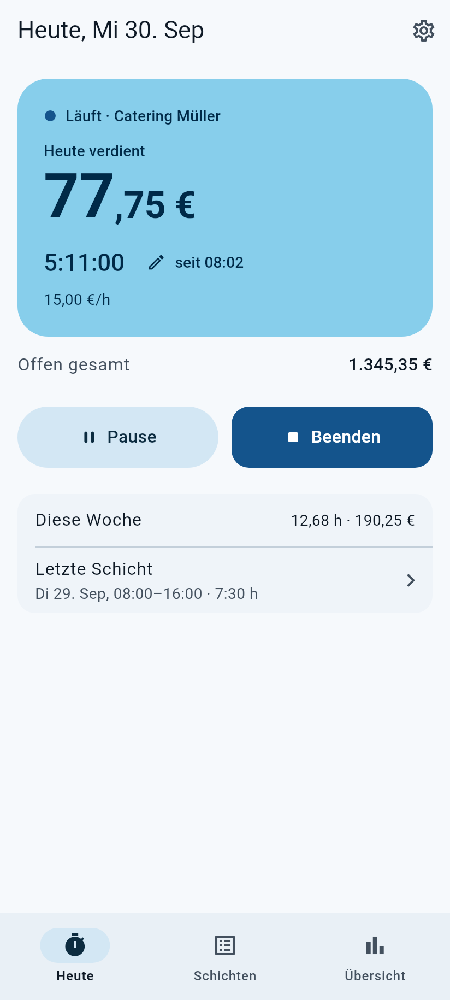
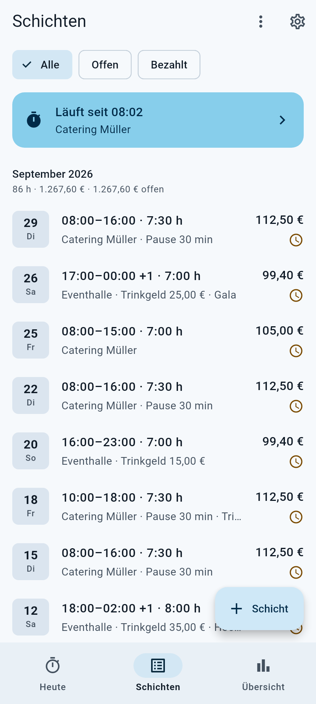
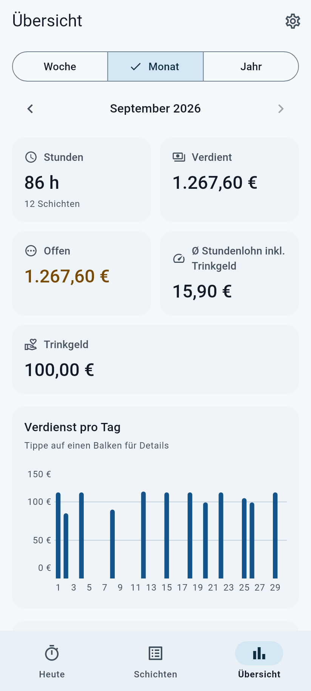
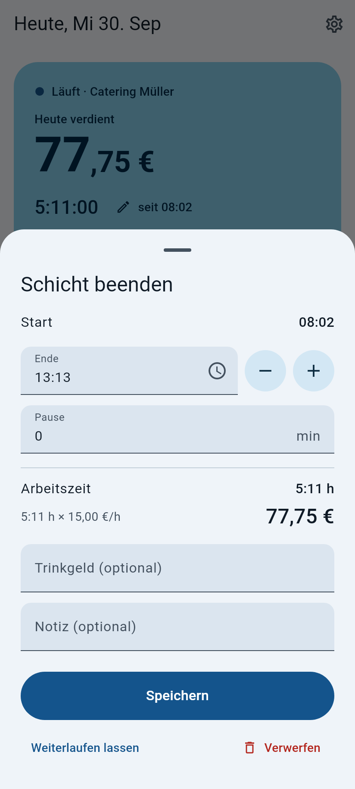
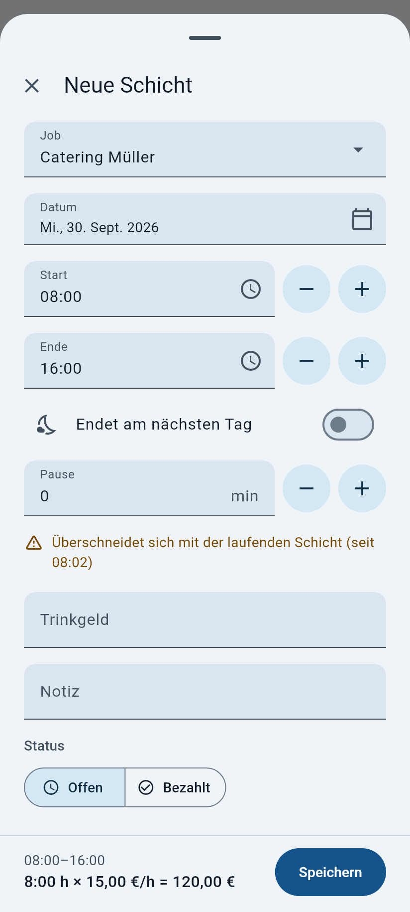
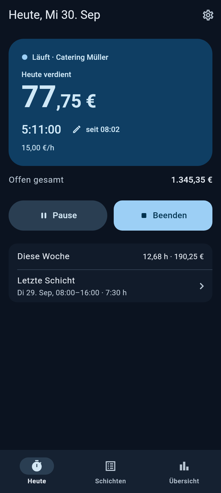
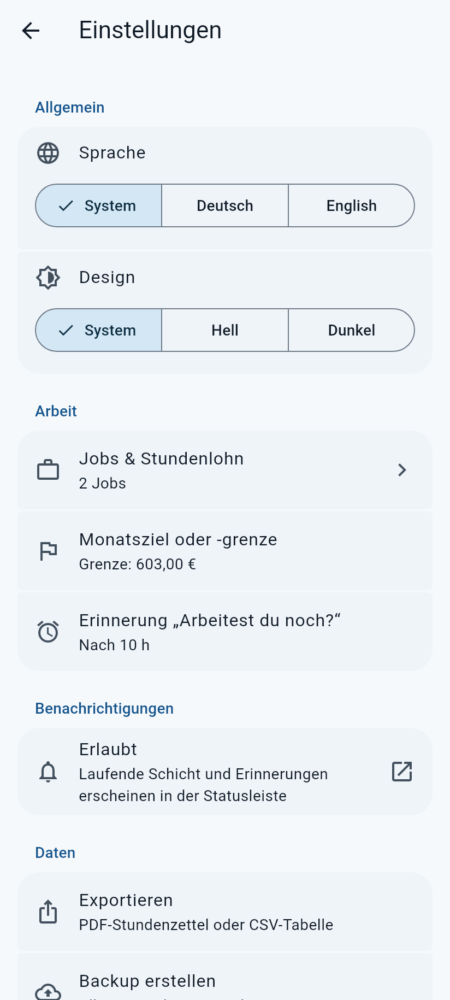
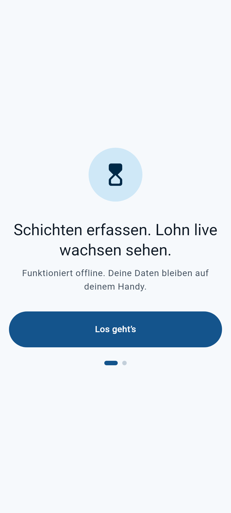
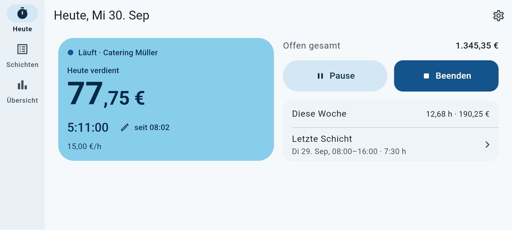
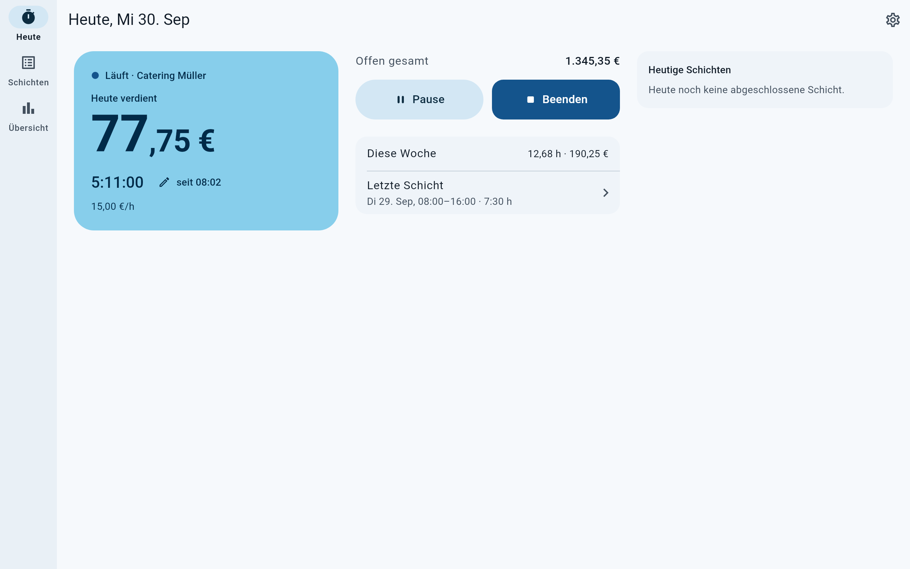

# Chronos

Arbeitszeit erfassen und dabei zusehen, wie der Lohn wächst – für alle, die stundenweise arbeiten:
Catering, Gastro, Aushilfe, Minijob. Chronos läuft komplett offline auf dem Handy (Android),
auf Deutsch und Englisch.

> Chronos 2.0 ist eine Neuentwicklung der Version 1.x. Daten aus 1.x werden beim ersten Start
> automatisch übernommen. Verbindlicher Funktionsumfang: [`docs/SPEC_2_0.md`](docs/SPEC_2_0.md).

## Screenshots

| Heute | Schichten | Übersicht |
|---|---|---|
|  |  |  |

| Schicht beenden | Schicht-Editor | Dunkles Design |
|---|---|---|
|  |  |  |

| Einstellungen | Erster Start |
|---|---|
|  |  |

**Querformat und Tablet**





Die Bilder werden aus der echten App gerendert:
`CHRONOS_SCREENSHOTS=1 TZ=Europe/Berlin flutter test --update-goldens test/screenshots`.

## Funktionen

**Heute**
- Schicht starten, pausieren, fortsetzen und beenden – auch mit „Früher angefangen?“.
- Großer Live-Betrag „Heute verdient“ mit rollenden Ziffern, gearbeitete Zeit, Stundenlohn, Pause.
- „Offen gesamt“: alles, was noch nicht ausgezahlt ist.
- „Schicht beenden“-Blatt mit Ende, Pause, Trinkgeld, Notiz und Rückgängig.
- Diese Woche und letzte Schicht auf einen Blick.

**Schichten**
- Liste nach Monaten mit Monatssummen, Filter Alle / Offen / Bezahlt.
- Schichten nachtragen, bearbeiten, duplizieren, löschen (mit Rückgängig).
- Wischen: bezahlt/offen umschalten oder löschen – auch per TalkBack-Aktion.
- Schichten über Mitternacht, Pausen, Trinkgeld, Notizen; Warnungen bei Überschneidungen und sehr langen Schichten.
- Auszahlung erfassen: „23 Schichten als bezahlt markieren“ mit erwartetem und erhaltenem Betrag.

**Übersicht**
- Woche / Monat / Jahr mit Stunden, Verdienst, Offen, Ø Stundenlohn inkl. Trinkgeld und Trinkgeld.
- Balkendiagramm mit Textalternative, Aufteilung nach Job, Liste der Auszahlungen.
- Optionales Monatsziel oder Monatsgrenze (z. B. Minijob-Grenze) mit Fortschrittsbalken.

**Jobs und Lohn**
- Mehrere Jobs mit Farbe, Rundung (aus / 5 / 15 Minuten) und Lohnhistorie („15,00 €/h seit 01.01.2026“).
- Lohnänderungen gelten ab einem Datum; alte Schichten behalten ihren Lohn.

**Benachrichtigung und Erinnerung**
- Laufende Schicht als Benachrichtigung mit Stoppuhr und den Aktionen Pause/Fortsetzen und Beenden.
- „Arbeitest du noch?“ nach 6, 8, 10 oder 12 Stunden (oder aus).
- Kein Hintergrunddienst, keine Timer im Hintergrund: gepostet wird nur bei Zustandswechseln.

**Daten**
- Export als PDF-Stundenzettel oder CSV (Excel-tauglich) über das Teilen-Menü.
- Backup als JSON erstellen und wiederherstellen (ersetzen oder zusammenführen).
- „Alle Daten löschen“ mit automatischer Sicherung und Rückgängig.
- Lokales Fehlerprotokoll, das man bei Bedarf selbst teilen kann.

**Erster Start**
- Ohne Daten: zwei kurze Schritte – Willkommen, dann Job und Stundenlohn.
- Mit Daten aus 1.x: automatische Übernahme; ein unplausibler Stundenlohn (z. B. „1.250,00 €/h“) wird
  nachgefragt, auffällige Einträge landen auf einer Prüfliste. Nichts wird still verändert oder verworfen.
- Startet etwas nicht: Wiederherstellungs-Bildschirm mit „Erneut versuchen“, „Rohdaten teilen“ und
  „Fehlerbericht teilen“.

**Für alle bedienbar**
- Hell und dunkel („Sky Day“ / „Navy Night“), Sprache und Design folgen dem System oder den Einstellungen.
- Hochkant, quer und Tablet; bis 200 % Schriftgröße ohne abgeschnittene Inhalte.
- Trefferflächen ab 48 dp, TalkBack-Beschriftungen, Zahlen und Daten im Format der Region (z. B. de-AT).

## Datenschutz

Chronos braucht kein Konto und keine Internetverbindung (die Release-App hat keine Internet-Berechtigung).
Alle Daten bleiben auf dem Gerät. Sie verlassen es nur, wenn du selbst etwas teilst (Export, Backup,
Fehlerbericht) oder wenn Android sie per Auto-Backup in dein eigenes Google-Konto sichert.
Keine Werbung, keine Analyse, kein Tracking. Details: [`privacy.html`](privacy.html).

## Bauen

Voraussetzungen: Flutter **3.47.5** (Dart 3.13), JDK 17 oder neuer, Android SDK.

```bash
flutter pub get
flutter gen-l10n                 # Lokalisierung (generierte Dateien sind eingecheckt)
dart run build_runner build -d   # nur nach Änderungen am drift-Schema
flutter run                      # Debug auf Gerät/Emulator
flutter build appbundle          # Release für Google Play
```

Signieren, Versionsnummern, Play-Upload und die Prüfliste für den ersten Build:
[`docs/ANDROID_BUILD.md`](docs/ANDROID_BUILD.md).

## Architektur

Schichten von oben nach unten: `features/` (UI) → `app/providers/` (Riverpod-Provider und Controller) →
`data/` (drift-Datenbank, Repositories, v1-Übernahme, Backup) → `domain/` (reines Dart: Lohn, Rundung,
Prüfung, Statistik) und `core/` (Datum, Zeit, Cent-Rechnung, Formatierer). Geld ist immer `int` Cent,
Zeit immer UTC plus Offset.

```
lib/
  main.dart         runApp sofort, alles Langsame hinter dem Startbildschirm
  app/              MaterialApp, Start-Gate, Shell, Benachrichtigungen, Lebenszyklus, Theme, Provider
  core/  domain/    reine Logik, vollständig getestet
  data/             drift, Repositories, v1-Übernahme, Backup, Export
  platform/         Benachrichtigungen, Teilen, App-Info
  features/         Heute, Schichten, Übersicht, Einstellungen, Onboarding, Prüfliste, Wiederherstellung
  widgets/          geteilte Bausteine
  l10n/             ARB-Dateien (Englisch = Vorlage, Deutsch) und generierte Lokalisierung
```

Ausführlich, mit Datenmodell und Beispielen: [`docs/ARCHITEKTUR.md`](docs/ARCHITEKTUR.md).
Regeln für die Entwicklung: [`CLAUDE.md`](CLAUDE.md).

## Tests

```bash
flutter analyze
flutter test
TZ=Europe/Berlin flutter test    # Zeitumstellungs-Fälle laufen nur in dieser Zeitzone
```

Die Tests laufen mit einer In-Memory-Datenbank und einer festen Test-Uhr. Jeder Bildschirm wird zusätzlich
in allen Größen (Handy hochkant/quer, Tablet), in beiden Designs, beiden Sprachen und mit 100 % und 200 %
Schrift auf Überlauf geprüft, dazu die Bedienungshilfe-Richtlinien (Trefferflächen, Beschriftungen, Kontrast).
